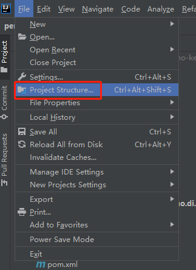
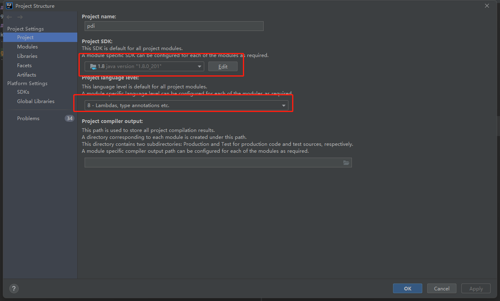
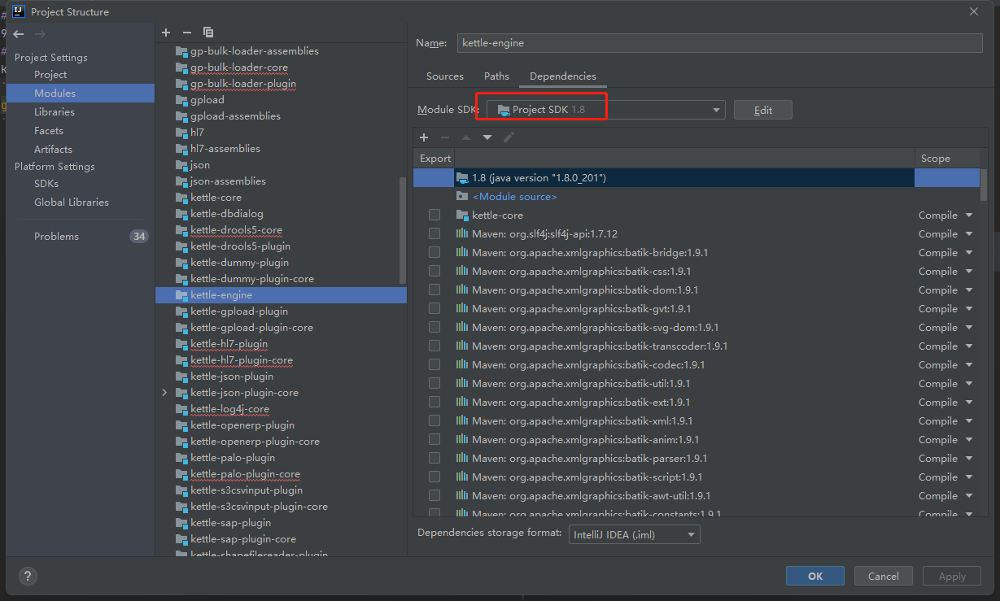
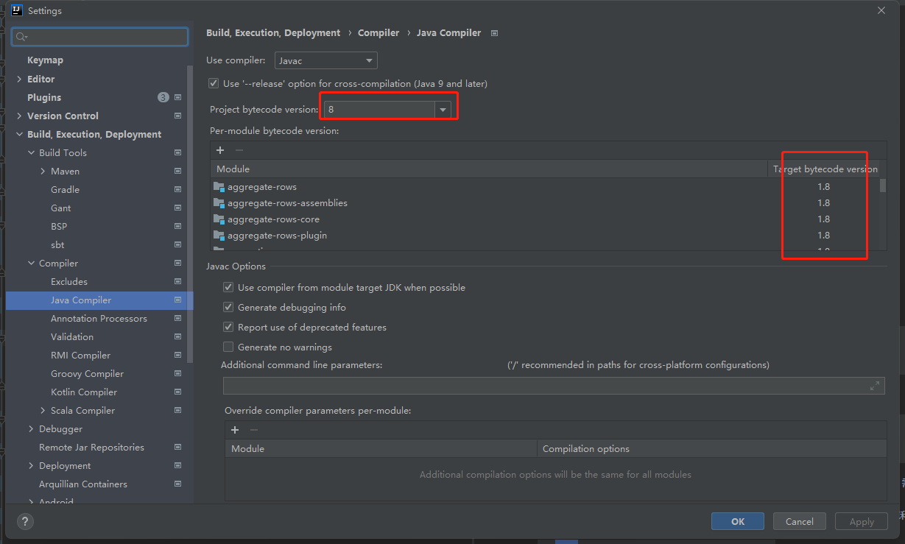
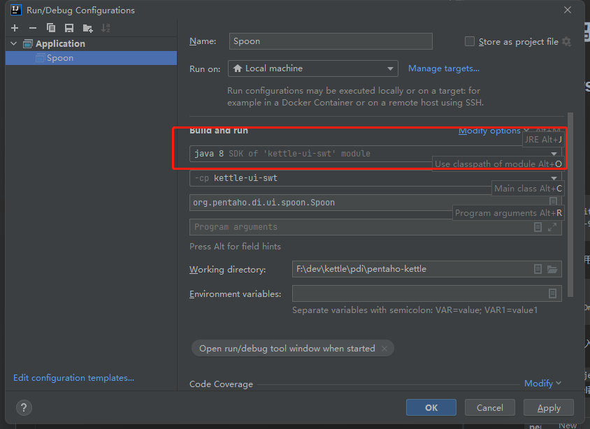

# 说明
该Kettle使用的版本是9.1.0.0-325，原项目地址https://github.com/pentaho/pentaho-kettle/tree/9.1.0.0-R

该项目主要为了想要研究Kettle源码，但苦于搭建开发环境的同学，基本都配置好了。

如果使用本项目代码搭建开发环境遇到问题，可以提issues。

windows可以提：https://github.com/shawn-happy/kettle/issues/1

mac可以提：https://github.com/shawn-happy/kettle/issues/2

# 搭建源代码开发环境
## 搭建windows开发环境操作步骤

1. 准备工作
   * java 8
   * maven 3.6.3
   * git

2. 下载源代码

```shell
git clone https://github.com/shawn-happy/kettle.git
git checkout kettle-9.1-windows
```

3. 打包下载依赖，使用maven下载依赖会时间比较久

```shell
cd kettle
mvn clean install -Dmaven.test.skip=true
```

4. 使用IDEA Intellij导入项目，如果本地jdk环境有多套，请将本项目的jdk配置成java 8，需要修改的地方有

   1. `File -> Project Structure -> Project Settings -> Project`将Project SDK和Project language level都换成java8

      

      

   2. `File -> Project Structure -> Project Settings -> Modules `确保所有Module都是Java8

      

   3. `File -> Settings -> Build,Execution,Deployment -> Compiler -> Java Compiler`将java编译版本都切换成java8

      

   4. 运行Spoon的时候，Run/Debug Configuration也要选择java8

      

5. 运行org.pentaho.di.ui.spoon.Spoon进行开发/测试。

## 搭建Mac开发环境操作步骤

# kettle相关资料

## 下载

下载地址：https://sourceforge.net/projects/pentaho/files/

从上面的下载地址下载会比较慢，我提供我本地的9.3版本的百度网盘下载地址:

```
链接：https://pan.baidu.com/s/1dhBuAhO4L3XkFtE4lVU0sw 
提取码：ss95 
```

## 官网和相关论坛

https://community.hitachivantara.com/home

官网里找相关的资料比较复杂，可以在中文论坛里寻求帮助

kettle中文网： http://www.kettle.org.cn/

Kettle实战100天：https://github.com/xiaoymin/KettleInAction100


